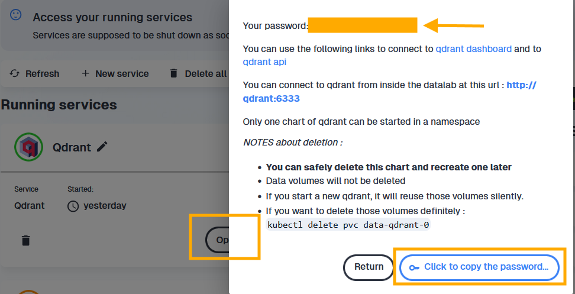

# What is a RAG, and why use one?

## The problem: classifying free-text labels

Statistical agencies routinely receive free-text descriptions of economic activities — from business registration forms, surveys, or administrative records — that need to be assigned a code from a standardised nomenclature such as **NACE 2.1**. This nomenclature contains hundreds of codes, each associated with a precise definition and scope notes.

Doing this manually is expensive. Automating it with a language model is appealing, but a naive approach — asking the model "what is the NACE code for this activity?" — has a major weakness: **LLMs do not reliably memorise fine-grained nomenclatures**. They may confuse similar codes, invent non-existent ones, or produce codes that belong to an older version of the classification.

## A solution: Retrieval-Augmented Generation

**RAG (Retrieval-Augmented Generation)** addresses this by splitting the task into two stages:

1. **Retrieve** — find the NACE codes whose descriptions are semantically closest to the input label, using a vector database and a dedicated language model.
2. **Generate** — ask an LLM to pick the best code *from the retrieved shortlist*, not from memory.

This approach combines the semantic power of embedding models with the reasoning ability of generative models, while keeping the LLM anchored to a controlled list of valid options.


::: {.callout-note #vec-db}
## What is a vector database?

A **vector database** is a storage system designed to hold high-dimensional numerical vectors (embeddings) and retrieve them by similarity rather than by exact match.

When a text is processed by an embedding model, it is converted into a dense vector of hundreds or thousands of numbers that encode its meaning. A vector database indexes these vectors so that, given a query vector, it can efficiently return the *k* nearest neighbours — the stored vectors that are most semantically similar to the query.

Key properties:

- **Semantic search**: finds documents by meaning, not keywords.
- **Fast approximate search**: uses algorithms such as HNSW (Hierarchical Navigable Small World) to search millions of vectors in milliseconds.
- **Payload storage**: each vector can carry arbitrary metadata (e.g. the NACE code and its description), returned alongside the search result.

In this tutorial we use **Qdrant**, an open-source vector database, to store and query the embeddings of all NACE 2.1 code descriptions.
:::

## RAG or fine-tuning a usual ML classifier?

Fine-tuning a usual ML classifier (like a FastText model) is a legitimate alternative that can yield excellent results when a large annotated dataset is available and the nomenclature is stable. The catch is that retraining is required each time the nomenclature changes, and building a quality training set takes real annotation effort.


With RAG, the __knowledge lives in the [vector database](#vec-db) rather than in the model weights__. Updating the nomenclature means re-indexing the changed entries — no retraining needed. This makes it a natural fit for statistical nomenclatures, which do evolve over time (NACE 2.1 being a recent example). That said, RAG is not annotation-free either: a labelled evaluation set is still needed to measure pipeline performance and tune its components. The right choice between the two approaches depends on data availability, update frequency, and available compute.


---

# What will you learn in this tutorial?

A Retrieval-Augmented Generation (RAG) pipeline combines a fast semantic search layer ([vector database](#vec-db) + embeddings) with a generation model (LLM). It is designed to:

- reduce hallucinations by grounding output in retrieved facts
- provide up-to-date domain knowledge without retraining the LLM
- scale to large knowledge bases by retrieving only the most relevant items per query

In this tutorial, the "retrieval" stage is handled by Qdrant and the "generation" stage by the SSPCloud `llm.lab` OpenAI-compatible API ([see the doc here](https://www.sspcloud.fr/document?path=SSPCloud%E2%90%A3Documentation%E2%80%BAOn%E2%90%A3Demand%E2%90%A3LLM%E2%80%BAIntroduction)). The tutorial is divided into two notebooks that map directly to the two parts of the workflow above.

## How RAG works (step-by-step)

1. **Query input** — User submits a natural language question, e.g. *"industrial bakery"*
2. **Query embedding** — Use an embedding model (`qwen3-embedding-8b`) to encode the query into a vector of size 4096.
3. **Vector search** — Query the Qdrant collection using the query vector to retrieve nearest neighbours (top-N contextual docs). Qdrant computes a distance/similarity score between the query vector and each stored vector. Common metrics include:
   - cosine similarity (most common, compares angle between vectors; 1 = identical)
   - dot product (fast, works well with normalised embeddings)
   - Euclidean/L2 distance (straight-line distance in vector space)

   In the notebook, you can configure `distance='Cosine'` when creating the collection.
4. **Context assembly** — Extract `payload` from retrieved points and concatenate into a single prompt section.
5. **Prompt construction** — Build a final prompt containing: a system instruction (task definition), the retrieved context, and the user query.
6. **LLM generation** — Send the prompt to a generation model via `client_llmlab.chat.completions.create(...)`.
7. **Post-processing** — Parse the output and optionally apply business rules (e.g. label mapping, thresholding).
8. **Evaluation** — Compare against ground truth labels and measure metrics (accuracy, F1, precision/recall).

### Simple pseudocode

```python
query_text = "industrial bakery"
query_vector = llm_lab.embeddings.create(
    model='qwen3-embedding-8b', input=query_text
).data[0].embedding

hits = qdrant_client.search(
    collection_name='nace_vdb', query_vector=query_vector, limit=5
)
context = "\n".join([hit.payload['text'] for hit in hits])

prompt = f"Use the following context to answer the question:\n{context}\nQuestion: {query_text}\nAnswer:"
result = llm_lab.chat.completions.create(
    model='gpt-oss:20b',
    messages=[{'role': 'user', 'content': prompt}]
)
print(result.choices[0].message.content)
```

## Tutorial structure

**Tutorial 1 — Building the vector database** (`2-rag-vdb.qmd`)

- Preprocess and embed all NACE 2.1 code descriptions using a dedicated language model
- Store the resulting vectors in a **Qdrant** collection
- Understand what a vector database is and how nearest-neighbour search works

**Tutorial 2 — Running and evaluating the RAG pipeline** (`2-rag-generation.qmd`)

- Load and inspect annotated examples
- Embed a free-text activity label and retrieve the `k` closest NACE candidates
- Build a retrieval + generation function that queries Qdrant and sends retrieved context to an LLM
- Compare predicted labels with ground truth for evaluation
- Understand how retrieval quality affects final generation quality

::: {.callout-note}
Both notebooks share the same infrastructure (Qdrant + llm.lab) and the same global parameters. Tutorial 1 must be completed before Tutorial 2, as it creates the vector collection that the pipeline depends on.
:::

---

# Technical requirements

## Services

You will need access to two services hosted on the SSPCloud:

| Service | Role |
|---------|------|
| **Qdrant** | [Vector database](#vec-db) storing NACE embeddings |
| **llm.lab** | LLM provider on premise (embedding model + generative model) |

## Credentials

Create a `.env` file at the root of your repository with the following variables:

```txt
QDRANT_URL=https://YOURNAMESPACE-qdrant.user.lab.sspcloud.fr/
QDRANT_API_KEY=xxxxxxxxxxxxxxxxxxxx
QDRANT_API_PORT=443
LLMLAB_API_KEY=xxxxxxxxxxxxxxxxxxxx
LLMLAB_URL=https://llm.lab.sspcloud.fr/api
```

::: {.callout-warning}
**Never commit your `.env` file.** Add it to your `.gitignore` immediately. Leaking API keys can expose your services to unauthorised use.
:::

### Getting your llm.lab API key

1. Go to the [llm.lab interface](https://llm.lab.sspcloud.fr/) and sign in with your SSPCloud account.
2. Open **Settings** (top right) → **Account** → **API Keys**.
3. Generate a new key and copy it into `LLMLAB_API_KEY`.


### Getting your Qdrant credentials

1. Launch a **Qdrant** service in your personal SSPCloud namespace.


2. Copy the generated token and save it as `QDRANT_API_KEY`. The URL follows the pattern `https://YOURNAMESPACE-qdrant.user.lab.sspcloud.fr/`.


You can also access your Qdrant Api key when you click on "Open" the Qdrant service.
The password shown in the pop-up bubble is your API key.



## Loading credentials in Python

Once your `.env` file is ready, load the variables at the start of each notebook:

```python
from dotenv import load_dotenv
load_dotenv()
```

To verify that a variable was loaded correctly:

```python
import os
try:
    QDRANT_URL = os.environ["QDRANT_URL"]
    print("QDRANT_URL loaded successfully")
except KeyError:
    raise ValueError("QDRANT_URL is not set — check your .env file")
```

If `load_dotenv()` doesn't work but every thing seems fine, don't forget to make sure that Python runs in the right working directory with `os.getcwd()`and `os.chdir("funathon-project2)`.

# Next Step

Go To [**Tutorial 1 — Building the vector database**](2-rag-vdb)
